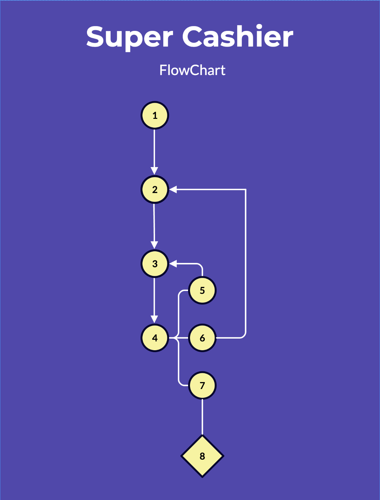
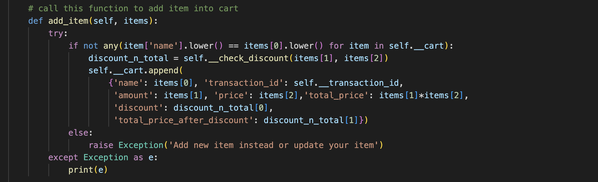

# Python-Project-Pacmann - Super-Cashier
### Muhammad Farid Zaki / muhammadfarid.zaki@gmail.com

# PROJECT BACKGROUNDS
Super Cashier is a quick shopping support tool, helping to automatically list their item into cart and print the invoice to the customers then record the transaction into database

# FEATURE REQUIREMENTS
1. Customers must be able to add or update items
2. Customers must be able to edit items on the list
3. Customers must be able to erase 1 items on the list
4. Customers must be able to reset their transaction
5. Customers must be able to see total transaction before proceed to pay
6. Customers can checkout their items
7. Customers get the "error message" when there's error on the input
8. Transaction then exported to sqlite

# FLOWCHART

1. Start Program
2. Program create transaction_id
3. Input Task
4. Options and showing order list
5. Customer adding, updating or delete items
6. Customer resets transaction
7. Customer checks out items 
8. Transaction recorded into database SQLite

# MODULES EXPLANATION

### 1. Libraries and Requirements

### 2. Class Transaction

Create class transaction with atribute self.cart to put the items in list

### 3. Add Item

Add item with parameters item name, item quantity and item price in dictionary per item and append the next item into the list

### 4. Update Item Name

Change certain item name in the list, with found list as the filtered item 

### 5. Update Item Quantity

Change certain item quantity in the list, with found list as the filtered item

### 6. Update Item Price

Change certain item price in the list, with found list as the filtered item

### 7. Delete Item

Delete certain item in the list, with found list as the filterd item

### 9. Reset Transaction

Reset the transaction list and start anew

### 10. Check Order

Check the transaction list in form of table using tabulate library, consist of item name, item quantity, item price and price total of item

### 11. Check out

Check out items from cart and export the data to database

### 11. Insert to table

Insert to table function

# HOW TO USE 

### 1. Download or Clone this project
### 2. Make sure to you have installed python and libraries globally
### 3. run App.py
### 4. Ready to use

# TEST CASE

### Following images is example of how i use the module using jupyter notebook

# CONCLUSION

Though this project still has much room for improvements, I believe this project has passed minimum requirement and works as the program is intended to do. Thanks
